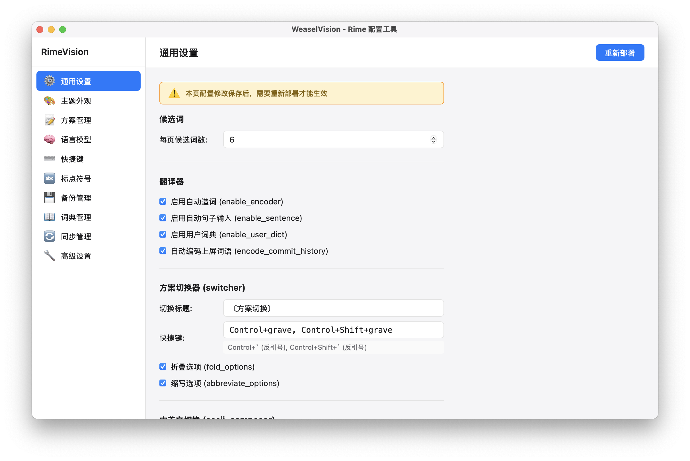

# WeaselVision

[](LICENSE)

[Rime 输入法](https://rime.im/)跨平台可视化配置工具，支持 macOS（鼠须管）和 Windows（小狼毫），无需手动编辑 YAML，通过直观的图形界面管理所有配置。

## 功能特性

### 界面预览



### 核心功能

| 模块 | 功能 |
|------|------|
| **通用设置** | 候选词数、编码扩展、中英切换、标点转换、模糊音 |
| **主题编辑** | 可视化编辑配色方案，实时预览候选窗口，支持亮色/暗色模式 |
| **方案管理** | 启用/禁用输入法方案，调整候选词数 |
| **语言模型** | 扫描/导入 `.gram` 语言模型，批量挂载/卸载到各方案 |
| **快捷键** | 直观配置全局按键绑定 |
| **标点符号** | 编辑半角/全角标点规则，支持添加/修改/删除/排序 |

### 高级功能

| 模块 | 功能 |
|------|------|
| **词典管理** | 词条浏览/搜索/编辑、批量删除低频词条、导出码表、清空词典、快照生成与应用 |
| **配置备份** | 手动备份、分类备份（核心/方案/主题/词典/模型/OpenCC/Lua）、自动备份、差异对比、一键回滚 |
| **同步管理** | 基于共享文件夹的多设备词典同步，支持 Rime 原生同步机制，合并远端快照 |
| **高级设置** | 配置文件状态查看、同步用户数据、重置自定义配置、编辑原始 YAML |

### 安全特性

- 配置修改前自动备份（滚动保留最新 10 个）
- 删除操作采用待删除标记机制（下次部署时统一执行，可随时撤销）
- 结构化 YAML 读写，防止配置损坏
- 全量恢复前自动创建安全备份，失败时中止并报错

## 系统要求

| 平台 | 要求 |
|------|------|
| **macOS** | macOS 13+，已安装 [鼠须管 (Squirrel)](https://github.com/rime/squirrel) |
| **Windows** | Windows 10 (1803+)，已安装 [小狼毫 (Weasel)](https://github.com/rime/weasel) |

## 安装

从 [Releases](../../releases) 下载对应平台的安装包：
- **macOS**: `.dmg` 文件（支持 Apple Silicon 和 Intel）
- **Windows**: `.exe` NSIS 安装包（支持 x64 和 ARM64）

> **首次启动**: macOS 用户可能需在 **系统设置 → 隐私与安全性** 中点击"仍要打开"。

## 从源码构建

需要 [Rust](https://www.rust-lang.org/tools/install) 和 [Node.js](https://nodejs.org/) (LTS)：

```bash
cd weasel_vision
npm install
npm run tauri dev      # 开发模式
npm run tauri build    # 构建安装包
```

## 技术栈

| 组件 | 技术 |
|------|------|
| 后端 | Rust |
| 框架 | [Tauri 2.0](https://tauri.app/) |
| 前端 | Vue 3 + TypeScript + Vite |
| YAML 解析 | [serde_yaml](https://github.com/dtolnay/serde-yaml) |
| 构建 | Cargo + npm |
| CSS 主题 | 自定义属性系统，自动跟随系统亮色/暗色模式 |

## 项目结构

```
Rime_vision/
├── weasel_vision/          # 跨平台版（核心项目）
│   ├── src/                # Vue 3 前端
│   │   ├── App.vue         # 主应用（路由 + 全局样式 + CSS 变量）
│   │   ├── components/     # 功能组件
│   │   └── utils.ts        # 工具函数
│   └── src-tauri/          # Rust 后端
│       ├── src/
│       │   ├── commands/   # Tauri 命令（前端调用）
│       │   ├── rime/       # Rime 引擎交互
│       │   └── lib.rs      # 入口
│       └── tauri.conf.json # Tauri 配置
├── archive/                # 归档（Swift 版本）
│   └── RimeVision/         # macOS-only Swift 版本（已归档）
└── .github/workflows/      # CI/CD
```

## 版本更新

### v0.2.0 (当前)

- **跨平台支持**: 从 macOS 扩展到 macOS + Windows
- **主题系统**: 全面适配暗色模式，CSS 变量系统
- **安全加固**: 自动备份错误传播、路径遍历防护、同步状态准确反馈
- **词典管理**: 词条 CRUD、快照生成、码表导出
- **同步管理**: Rime 原生同步机制集成
- **备份系统**: 分类备份（7 类 + 全量）、差异对比、一键回滚
- **代码清理**: 移除未使用事件、修复死代码循环、完善错误处理

### v0.1.0 (RimeVision Swift 版)

- macOS 专用版本，已归档至 `archive/`

## 许可证

[MIT License](LICENSE)
